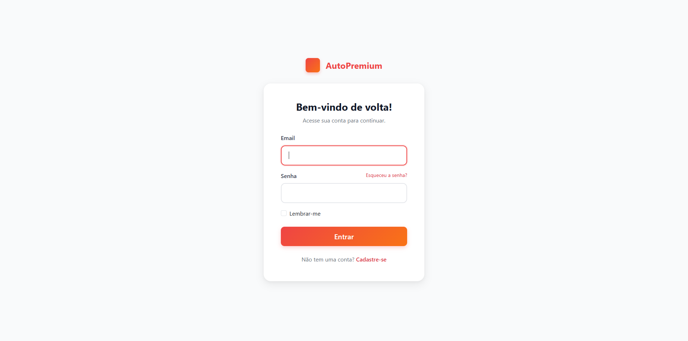
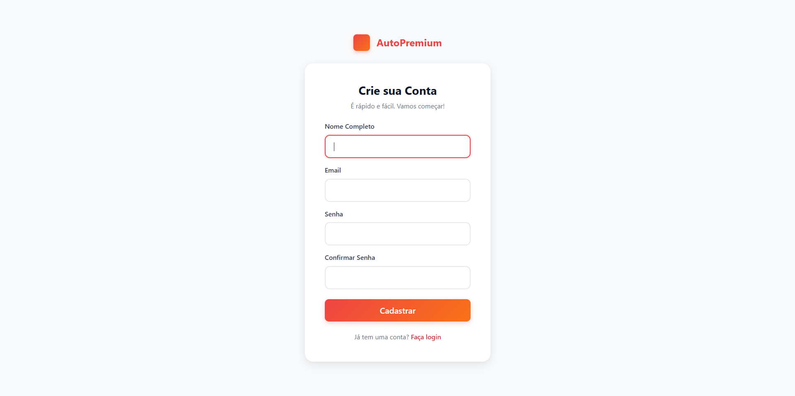
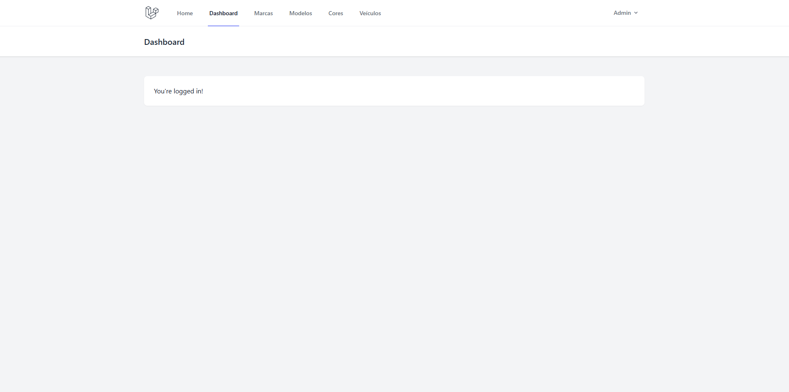

# AutoPremium - Sistema de Classificados de Veículos

Este é um projeto desenvolvido em Laravel que simula um site de classificados de veículos. Ele possui uma vitrine pública para os carros e um painel administrativo para gerenciar o inventário (marcas, modelos, cores e veículos).

## Funcionalidades

- **Vitrine Pública:** Página inicial que exibe todos os veículos disponíveis para venda.
- **Página de Detalhes:** Visualização detalhada de cada veículo com uma galeria de fotos em carrossel, especificações e descrição.
- **Autenticação de Usuários:** Sistema completo de login e registro.
- **Painel Administrativo (Dashboard):** Área restrita para usuários logados gerenciarem o conteúdo do site.
- **Gerenciamento de Inventário (CRUD):**
  - Adicionar e Excluir Marcas.
  - Adicionar e Excluir Modelos.
  - Adicionar e Excluir Cores.
  - Adicionar e Excluir Veículos.
- **Seeders:** Populando o banco de dados com dados iniciais (usuários, marcas, modelos, cores e veículos) para facilitar os testes.

---

## Como Rodar o Projeto

Siga os passos abaixo para configurar e executar o projeto em seu ambiente local.

### Pré-requisitos

- PHP >= 8.2
- Composer
- Node.js e NPM (Opcional, para assets)
- Um servidor de banco de dados (ex: MySQL, MariaDB)

### Passos para Instalação

1.  **Clone o repositório:**
    ```bash
    git clone [URL_DO_SEU_REPOSITORIO_AQUI]
    cd [NOME_DA_PASTA_DO_PROJETO]
    ```

2.  **Instale as dependências do PHP:**
    ```bash
    composer install
    ```

3.  **Configure o arquivo de ambiente:**
    Copie o arquivo de exemplo `.env.example` para um novo arquivo chamado `.env`.
    ```bash
    cp .env.example .env
    ```

4.  **Edite o arquivo `.env`** e configure as credenciais do seu banco de dados:
    ```
    DB_CONNECTION=mysql
    DB_HOST=127.0.0.1
    DB_PORT=3306
    DB_DATABASE=autopremium
    DB_USERNAME=root
    DB_PASSWORD=
    ```

5.  **Gere a chave da aplicação:**
    ```bash
    php artisan key:generate
    ```

6.  **Execute as migrations e popule o banco de dados:**
    Este comando irá criar todas as tabelas e preenchê-las com os dados iniciais (usuários e veículos).
    ```bash
    php artisan migrate:fresh --seed
    ```

7.  **Inicie o servidor de desenvolvimento:**
    ```bash
    php artisan serve
    ```

8.  Acesse o projeto em seu navegador no endereço: `http://127.0.0.1:8000`

---

## Credenciais de Acesso

O sistema é populado com dois usuários para teste:

-   **Usuário Administrador:**
    -   **Email:** `admin@autopremium.com`
    -   **Senha:** `password`

-   **Usuário Comum (Guest):**
    -   **Email:** `escobar@autopremium.com`
    -   **Senha:** `password`

---

## Telas do Sistema

Abaixo estão as capturas de tela de todas as principais funcionalidades do projeto.

### 1. Páginas Públicas

**Página Inicial (Home)**
*Exibe a vitrine de veículos disponíveis para todos os visitantes.*


**Página de Detalhes do Veículo**
*Mostra todas as informações, descrição e uma galeria de fotos em carrossel de um veículo específico.*


### 2. Autenticação

**Página de Login**


**Página de Cadastro (Registro)**


### 3. Painel Administrativo (Dashboard)

**Dashboard Principal**
*Página inicial do painel após o login.*
